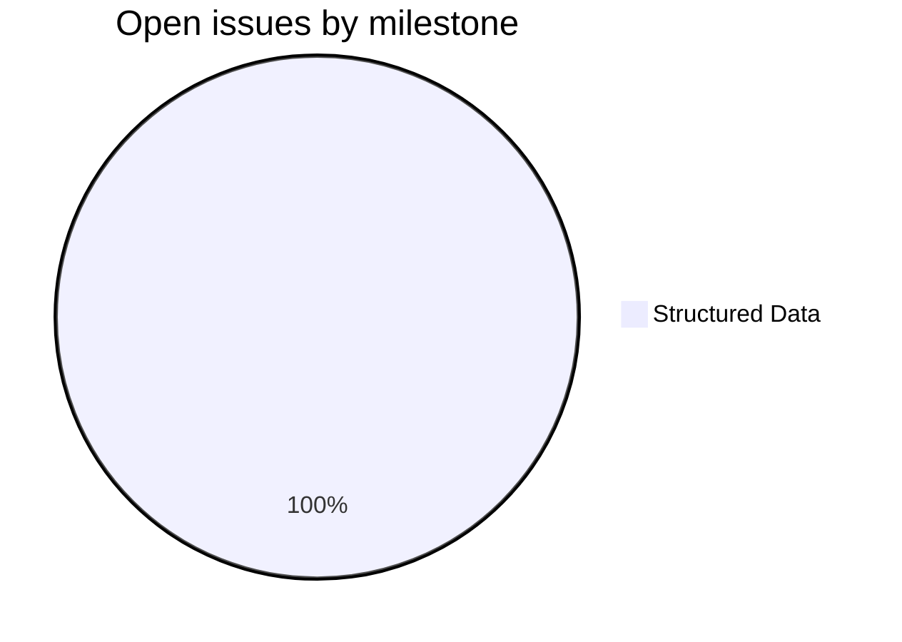
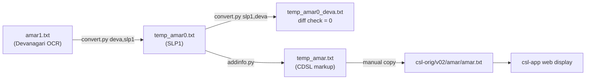
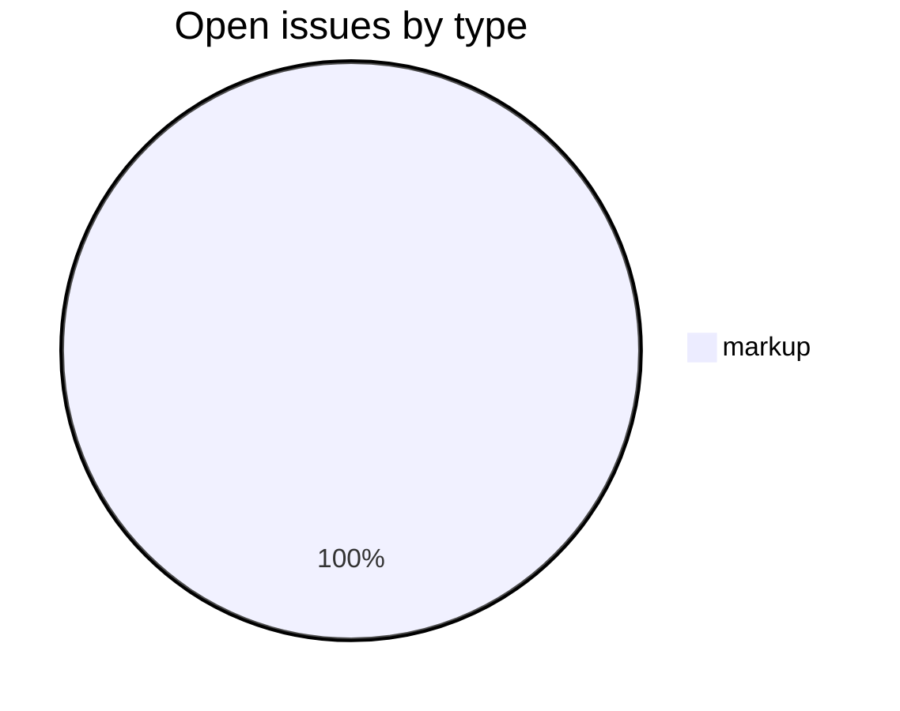

# AMAR — Amarakośa in CDSL Format

_Created: 30-01-2024 · Last updated: 11-07-2026_

The **AMAR** repository converts the *Amarakośa* (*Nāmaliṅgānuśāsana*) of Amarasiṃha from its OCR Devanagari source into the Cologne Digital Sanskrit Lexicon (CDSL) plain-text format. The result, [amar.txt](https://github.com/sanskrit-lexicon/AMAR/blob/main/amar.txt), feeds into the CDSL build pipeline and the [csl-orig](https://github.com/sanskrit-lexicon/csl-orig) repository.

The *Amarakośa* is the most widely cited classical Sanskrit thesaurus, organised into three *kāṇḍa*s and dozens of thematic *varga*s. Each entry lists synonyms with grammatical-gender codes in SLP1 transliteration.

## Contents

| File / Dir | Description |
|---|---|
| [docs/CONVERSION_MANUAL.md](https://github.com/sanskrit-lexicon/AMAR/blob/main/docs/CONVERSION_MANUAL.md) | **Operator manual** — re-running, verifying, and extending the pipeline end-to-end (cheat-sheet, walkthrough, symptom→cure, maintainer appendix); metadoc at [docs/CONVERSION_MANUAL.meta.md](https://github.com/sanskrit-lexicon/AMAR/blob/main/docs/CONVERSION_MANUAL.meta.md) |
| [amar1.txt](https://github.com/sanskrit-lexicon/AMAR/blob/main/amar1.txt) | OCR source in Devanagari (from drdhaval2785/sanskrit-lexica-ocr) |
| [amar.txt](https://github.com/sanskrit-lexicon/AMAR/blob/main/amar.txt) | Processed CDSL-format output (published version) |
| [convert.py](https://github.com/sanskrit-lexicon/AMAR/blob/main/convert.py) | Devanagari ↔ SLP1 transcoder driver |
| [addinfo.py](https://github.com/sanskrit-lexicon/AMAR/blob/main/addinfo.py) | Adds CDSL structural markup to the SLP1 intermediate |
| [gender_list.py](https://github.com/sanskrit-lexicon/AMAR/blob/main/gender_list.py) | Generates gender-frequency list from `amar.txt` |
| [gender_list.txt](https://github.com/sanskrit-lexicon/AMAR/blob/main/gender_list.txt) | Gender frequency list output |
| [transcoder.py](https://github.com/sanskrit-lexicon/AMAR/blob/main/transcoder.py) + [transcoder/](https://github.com/sanskrit-lexicon/AMAR/tree/main/transcoder) | SLP1 / Devanagari / IAST transcoding engine and tables |
| [redo.sh](https://github.com/sanskrit-lexicon/AMAR/blob/main/redo.sh) | Pipeline orchestrator |
| [index.html](https://github.com/sanskrit-lexicon/AMAR/blob/main/index.html) | GitHub Pages landing page |
| [changelog.md](https://github.com/sanskrit-lexicon/AMAR/blob/main/changelog.md) | Dated maintenance snapshots |
| [CITATION.cff](https://github.com/sanskrit-lexicon/AMAR/blob/main/CITATION.cff) | CFF 1.2.0 academic citation metadata |
| [LICENSE](https://github.com/sanskrit-lexicon/AMAR/blob/main/LICENSE) | CC-BY-SA-4.0 |

## Timeline

| Period | Work |
|---|---|
| 30 Jan 2024 | Initial conversion: `amar1.txt` (Devanagari OCR) → `amar.txt` (CDSL format); gender frequency list generated |
| May 2026 | [CLAUDE.md](https://github.com/sanskrit-lexicon/AMAR/blob/main/CLAUDE.md) added; README and full issue triage (labels, milestones, projects); CITATION.cff enriched with publication metadata |
| Jun 2026 | [changelog.md](https://github.com/sanskrit-lexicon/AMAR/blob/main/changelog.md) started |
| Jul 2026 | GitHub Pages landing page ([index.html](https://github.com/sanskrit-lexicon/AMAR/blob/main/index.html)) added |

## Projects & Milestones

Milestones follow the Cologne dictionary-repo convention (Dictionary to Book · Digitization Quality · Structured Data · Major Enhancements).

| # | Milestone | Open | Closed |
|---|---|---|---|
| 1 | Dictionary to Book | 0 | 0 |
| 2 | Digitization Quality | 0 | 0 |
| 3 | Structured Data | 1 | 0 |
| 4 | Major Enhancements | 0 | 0 |

## How it works

Corrections to the published dictionary text are never made directly to the csl-orig source; they are expressed as change files applied by scripts, per the canonical [csl-orig correction workflow](https://github.com/sanskrit-lexicon/csl-corrections/blob/main/docs/correction-workflow.md).

## Encoding

- UTF-8 NFC throughout.
- Sanskrit text in SLP1 transliteration, wrapped in `<s>…</s>`.
- Display layer uses IAST (ISO 15919) and Devanagari, generated via [transcoder/](https://github.com/sanskrit-lexicon/AMAR/tree/main/transcoder).
- Round-trip verified: `amar1.txt` → SLP1 → Devanagari produces zero diff lines.

## Issue Typology

### Open issues

| # | Title | Type | Severity | Milestone |
|---|---|---|---|---|
| [#1](https://github.com/sanskrit-lexicon/AMAR/issues/1) | Gender information for meanings in nAnArthavarga | `markup` | `medium` | Structured Data |

### Solved issues

No closed dictionary issues yet.

## Labels

### Type labels

| Label | Color | When to use |
|---|---|---|
| `link-target` | `#0075ca` | Building click-throughs from `<ls>` abbreviations to scanned PDF pages |
| `link-splitting` | `#0075ca` | Splitting combined `SOURCE N,N` refs into individual per-page links |
| `markup` | `#0075ca` | Normalising XML/CDSL tag content (`<s>`, `<info>`, `<eid>`, etc.) |
| `text-correction` | `#0075ca` | Corrections to Sanskrit text or synonym lists |
| `content-enhancement` | `#0075ca` | New material, display upgrades, structural additions |
| `encoding` | `#0075ca` | SLP1/IAST/Devanagari transcoding, character rendering |
| `scan-quality` | `#0075ca` | Replacing blurry, skewed, or missing scan pages |
| `bug` | `#0075ca` | Broken links, structural errors, broken download files |
| `question` | `#0075ca` | Scholarly or editorial questions requiring research |

### Severity labels

| Label | Color | When to use |
|---|---|---|
| `minor` | `#e4e669` | Targeted, self-contained fix |
| `medium` | `#fbca04` | Standard unit of work — one varga, a batch of corrections |
| `hard` | `#d93f0b` | Large effort spanning many vargas or kāṇḍas |

## Source

- **Author**: Amarasiṃha (anc., fl. c. 4th–7th century CE)
- **Title**: *Nāmaliṅgānuśāsana* (Amarakośa)
- **Genre**: Sanskrit thesaurus (kośa), three kāṇḍas
- **First digitisation**: University of Hyderabad SCL / drdhaval2785 (Project Sanskrit-Lexica-OCR), 2020
- **OCR source**: [namalinganushasana.txt](https://github.com/drdhaval2785/sanskrit-lexica-ocr/blob/master/namalinganushasana_amarasinha/orig/namalinganushasana.txt)
- **CDSL integration**: [Cologne Digital Sanskrit Lexicon](https://www.sanskrit-lexicon.uni-koeln.de/)

## Contributors

| GitHub | Contributions |
|---|---|
| [gasyoun](https://github.com/gasyoun) | 10 commits |
| [drdhaval2785](https://github.com/drdhaval2785) | 5 commits |

_Dr. Mārcis Gasūns_
