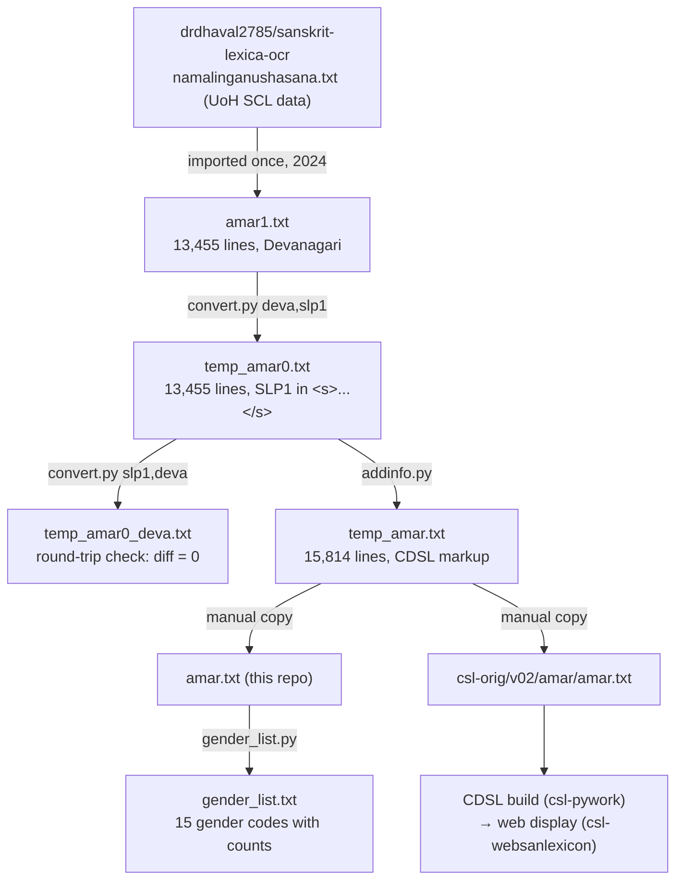

# AMAR conversion pipeline — operator manual

_Created: 11-07-2026 · Last updated: 11-07-2026_

This is the **operator manual** for the AMAR conversion pipeline: how to re-run,
verify, and extend the transformation of the OCR Devanagari *Amarakośa* into the
CDSL plain-text format, end-to-end, without reading the source code. Every command
below was executed and its outputs verified on 11-07-2026 against the committed
data; the numbers quoted (line counts, entry counts, change counts) are measured,
not copied from older docs.

Three documents describe this repo, with different jobs — not three parallel
truths:

- **What the repo is and its history** —
  [README.md](https://github.com/sanskrit-lexicon/AMAR/blob/main/README.md);
- **Code contract for AI/code sessions** (tag table, issue taxonomy) —
  [CLAUDE.md](https://github.com/sanskrit-lexicon/AMAR/blob/main/CLAUDE.md);
- **How to actually operate the pipeline** (this document) —
  [docs/CONVERSION_MANUAL.md](https://github.com/sanskrit-lexicon/AMAR/blob/main/docs/CONVERSION_MANUAL.md).

## Cheat-sheet: the whole pipeline on one screen

Run everything from the **repo root** (see [why](#run-from-the-repo-root-only)).

```sh
# 1. Full pipeline: Devanagari OCR → SLP1 → round-trip check → CDSL markup
sh redo.sh
#    internally:
#    python convert.py deva,slp1 amar1.txt temp_amar0.txt        # → SLP1
#    python convert.py slp1,deva temp_amar0.txt temp_amar0_deva.txt  # back-convert
#    diff amar1.txt temp_amar0_deva.txt | wc -l                  # must be 0 (see CRLF note)
#    python addinfo.py temp_amar0.txt temp_amar.txt              # → CDSL markup

# 2. Verify the output reproduces the committed file (should print 0)
diff --strip-trailing-cr temp_amar.txt amar.txt | wc -l

# 3. Publish (only when the output is intentionally different)
cp temp_amar.txt amar.txt                          # repo copy
cp temp_amar.txt ../csl-orig/v02/amar/amar.txt     # CDSL copy (sibling checkout)

# 4. QC: regenerate the gender-frequency list
python gender_list.py amar.txt gender_list.txt
```

Expected checkpoints (measured 11-07-2026):

| Checkpoint | Expected |
|---|---|
| Round-trip diff (`amar1.txt` vs `temp_amar0_deva.txt`) | 0 lines (on Windows use `diff --strip-trailing-cr`) |
| `addinfo.py` console output | `1155 changes in info_1` · `0 changes in info_2` |
| `temp_amar0.txt` line count | 13,455 (same as `amar1.txt`) |
| `temp_amar.txt` line count | 15,814 = 13,455 + 2,359 injected `<info .../>` lines |
| `<L>` entries in output | 2,359 |
| Reproducibility (`temp_amar.txt` vs committed `amar.txt`) | 0 diff lines |

Diagnostics on the run — jump to
[Symptom → cause → cure](#symptom--cause--cure).

## Data flow



Sibling-repo dependencies enter only at the publish step:
[csl-orig](https://github.com/sanskrit-lexicon/csl-orig) receives the converted
text, and the CDSL build/display layers are wired per the
[downstream integration checklist](#stage-4--publish-and-wire-downstream).
Everything upstream of that runs entirely inside this repo with the Python
standard library.

## Environment and prerequisites

- **Python 3** — standard library only; no pip installs. (`codecs.open()`
  DeprecationWarnings on modern Pythons are cosmetic — see
  [symptom table](#symptom--cause--cure).)
- **A POSIX shell** with `diff` (Git Bash suffices on Windows) for
  [redo.sh](https://github.com/sanskrit-lexicon/AMAR/blob/main/redo.sh).
- **This repo's own data** — the OCR source
  [amar1.txt](https://github.com/sanskrit-lexicon/AMAR/blob/main/amar1.txt) and
  the transcoding tables in
  [transcoder/](https://github.com/sanskrit-lexicon/AMAR/tree/main/transcoder)
  are committed; nothing is fetched.
- **Optional, publish step only:** a sibling checkout of
  [csl-orig](https://github.com/sanskrit-lexicon/csl-orig) at `../csl-orig`.
- No secrets, no network access.

### Run from the repo root only

[convert.py](https://github.com/sanskrit-lexicon/AMAR/blob/main/convert.py)
initialises the transcoding engine with the **relative** path
`transcoder.transcoder_set_dir('transcoder')`, and
[redo.sh](https://github.com/sanskrit-lexicon/AMAR/blob/main/redo.sh) addresses
`amar1.txt` relatively too. Invoked from any other working directory, the
transcoder tables are not found. Always `cd` to the repo root first.

### Windows checkout note (CRLF)

With `git config core.autocrlf true` (the common Windows default), the checked-out
`amar1.txt` and `amar.txt` carry CRLF line endings, while every pipeline script
writes plain LF. Both "must be 0" checks then report tens of thousands of
phantom diff lines (26,912 and 31,630 measured on 11-07-2026) that vanish with
`diff --strip-trailing-cr`. The data is identical; only the line terminators
differ. Use `--strip-trailing-cr` on Windows, or check out with `eol=lf`.

## Step-by-step operator walkthrough

### Stage 0 — the source: `amar1.txt`

[amar1.txt](https://github.com/sanskrit-lexicon/AMAR/blob/main/amar1.txt)
(13,455 lines, UTF-8 NFC, Devanagari) is the proofread OCR of Amarasiṃha's
*Nāmaliṅgānuśāsana*, imported once in January 2024 from
[drdhaval2785/sanskrit-lexica-ocr](https://github.com/drdhaval2785/sanskrit-lexica-ocr/blob/master/namalinganushasana_amarasinha/orig/namalinganushasana.txt)
(University of Hyderabad SCL digitisation; format documented in the
[sanskrit-kosha annotation notes](https://github.com/sanskrit-kosha/kosha/blob/master/docs/annotation_thoughts.md)).
It is **not regenerated** by this pipeline — treat it as read-only input. The
file has two halves split by the `;CONTENT` marker at line 50: a `;METADATA`
block of `;key{value}` lines, then the text body with structure markers
(`;k{...}` kāṇḍa, `;v{...}` varga, `;vv{...}` upavarga, `;c{...}` caption,
`;p{N}` page break), `<L>N<pc>`/`<LEND>` entry brackets, `<eid>N<syns>` synonym
lines, and bare Devanagari verse lines.

### Stage 1 — Devanagari → SLP1: `convert.py deva,slp1`

```sh
python convert.py deva,slp1 amar1.txt temp_amar0.txt
```

For each line, every maximal run of Devanagari codepoints (`U+0900–U+097F`) is
wrapped in `<s>...</s>` and transcoded to SLP1 by the
[transcoder.py](https://github.com/sanskrit-lexicon/AMAR/blob/main/transcoder.py)
engine using
[transcoder/deva_slp1.xml](https://github.com/sanskrit-lexicon/AMAR/blob/main/transcoder/deva_slp1.xml).
Two cosmetic joins follow: adjacent fragments separated by non-tag text are
merged (`</s> <s>` → ` ` inside one `<s>` span), and a trailing hyphen after a
closing tag is moved inside (`</s>-` → `-</s>`). Line count is preserved
exactly (13,455 in → 13,455 out); non-Devanagari text (the `;key{...}` names,
Latin URLs, digits) passes through untouched.

### Stage 2 — the round-trip proof: `convert.py slp1,deva`

```sh
python convert.py slp1,deva temp_amar0.txt temp_amar0_deva.txt
diff amar1.txt temp_amar0_deva.txt | wc -l    # must be 0
```

The inverse conversion (via
[transcoder/slp1_deva.xml](https://github.com/sanskrit-lexicon/AMAR/blob/main/transcoder/slp1_deva.xml),
stripping the `<s>` markup) must reproduce the source **byte-for-byte** — this
is the pipeline's lossless-transliteration guarantee. Verified 11-07-2026:
0 diff lines (with `--strip-trailing-cr` on a CRLF checkout — see the
[Windows note](#windows-checkout-note-crlf)). Any non-zero result after a code
or table change means the transliteration lost information: stop and fix before
proceeding to stage 3.

### Stage 3 — CDSL markup: `addinfo.py`

```sh
python addinfo.py temp_amar0.txt temp_amar.txt
# console: 1155 changes in info_1 / 0 changes in info_2
```

Three passes, applied in order
([addinfo.py](https://github.com/sanskrit-lexicon/AMAR/blob/main/addinfo.py)):

1. **`info_1` — verse-number inference.** Inside each `<L>...<LEND>` entry,
   numbered verse lines look like `... .. 68 ..</s>`; the pass tracks the last
   seen number. When the **final** line of an entry is an unnumbered partial
   verse ending in ` .</s>`, it gets the inferred next number appended as a
   parenthetical: ` (69) .</s>`. 1,155 lines are annotated this way. The pass
   also prints `WARNING <line>` for any entry whose last line does not end in
   `.</s>` (zero on current data).
2. **`info_2` — page breaks: disabled.** The call is commented out in `main`;
   `;p{N}` handling awaits coordination with the XML build (and current data
   contains no `;p{N}` lines inside entries anyway). The console line
   `0 changes in info_2` is actually printed by `info_3`, which reuses the
   message string — cosmetic, see the [defect list](#observed-defects-and-latent-traps).
3. **`info_3` — kāṇḍa/varga/upavarga annotation.** Walking the file, the pass
   tracks the current `;k{...}`, `;v{...}`, `;vv{...}` headers (resetting the
   lower levels when a higher one changes) and injects one
   `<info kvvv="..."/>` line directly after every `<L>` metaline — 2,359
   injections, which is exactly the output growth: 13,455 + 2,359 = 15,814
   lines.

The output entry format (tag table, annotated example, gender codes) is
documented in
[CLAUDE.md § Data Format](https://github.com/sanskrit-lexicon/AMAR/blob/main/CLAUDE.md#data-format)
— not repeated here.

### Stage 4 — publish and wire downstream

`redo.sh` deliberately stops with a question ("Do you want to copy...?") rather
than overwriting anything. Publishing is manual:

```sh
diff --strip-trailing-cr temp_amar.txt amar.txt   # review what changed
cp temp_amar.txt amar.txt                          # update the repo copy
cp temp_amar.txt ../csl-orig/v02/amar/amar.txt     # update the CDSL copy
```

First-time CDSL integration (already done for AMAR; needed again only if the
dictionary is re-onboarded) additionally requires, per
[CLAUDE.md § Downstream Integration](https://github.com/sanskrit-lexicon/AMAR/blob/main/CLAUDE.md#downstream-integration):
`amar-meta2.txt`, `amar_hwextra.txt`, `amarheader.xml` in csl-orig; an AMAR row
in csl-pywork's `dictparms.py` + `inventory.txt`; and a `distinctfiles/amar/`
tree in [csl-websanlexicon](https://github.com/sanskrit-lexicon/csl-websanlexicon).

Two delivery rules from the org level apply verbatim:

- Corrections to the **published** text are never edited directly into csl-orig
  sources — they go through change files per the canonical
  [csl-orig correction workflow](https://github.com/sanskrit-lexicon/csl-corrections/blob/main/docs/correction-workflow.md).
- Agent sessions never push to csl-orig directly; corrections queue locally and
  ship as one consolidated PR ~monthly (org
  [CLAUDE.md](https://github.com/gasyoun/github-spine/blob/main/CLAUDE.md) rule).

### QC — the gender-frequency census: `gender_list.py`

```sh
python gender_list.py amar.txt gender_list.txt
```

Splits every `<eid>N<syns><s>...</s>` synonym list on commas, takes the
`-gender` suffix of each synonym (`ajYAta` "unknown" when absent), and writes a
count-per-code table to
[gender_list.txt](https://github.com/sanskrit-lexicon/AMAR/blob/main/gender_list.txt)
(15 codes on current data; `puM` 5,097 · `strI` 2,356 · `klI` 2,072 ·
`ajYAta` 2,084 · `tri` 1,614 lead). Rerun it after any change to `amar.txt`;
a shifted distribution is a cheap smoke test that synonym markup wasn't
corrupted. Note the script echoes every synonym to stdout while running —
redirect if you want a quiet run. A gender code appearing in the data but
missing from the script's name table crashes the run — that is a **useful**
canary, see the [symptom table](#symptom--cause--cure).

## Re-running and extending

**Idempotence is the regression test.** The pipeline is deterministic:
`sh redo.sh` from a clean checkout reproduces the committed `amar.txt` with
zero diff lines (verified 11-07-2026). So after **any** change — to a script, a
transcoder table, or `amar1.txt` itself — the full verification loop is:

```sh
sh redo.sh                                          # watch: round-trip diff 0, "1155 changes"
diff --strip-trailing-cr temp_amar.txt amar.txt      # empty = nothing regressed;
                                                     # non-empty = exactly your intended change
```

All `temp_*` files are gitignored
([.gitignore](https://github.com/sanskrit-lexicon/AMAR/blob/main/.gitignore)),
so an exploratory run never dirties the tree.

**Adding a new transform** is adding an `info_N` pass to
[addinfo.py](https://github.com/sanskrit-lexicon/AMAR/blob/main/addinfo.py):
write a `lines → newlines` function following the `info_1`/`info_3` skeleton
(track entry state via `<L>`/`<LEND>`, print a change count), chain it in
`main` after `info_3`, run the loop above, and review the diff. Keep the two
invariants in the [appendix](#invariants) intact; if the pass adds lines, update
the expected line-count arithmetic there.

## Symptom → cause → cure

| Symptom | Cause | Cure |
|---|---|---|
| Round-trip diff prints ~27k lines; `temp_amar.txt` vs `amar.txt` ~32k lines — on Windows | `core.autocrlf true` checked the sources out with CRLF; scripts write LF ([note](#windows-checkout-note-crlf)) | `diff --strip-trailing-cr`, or re-checkout with `eol=lf`; the content is identical |
| Round-trip diff non-zero on LF-clean data | A transcoder-table or `convert.py` change lost information | Diff `amar1.txt` vs `temp_amar0_deva.txt` to find the affected lines; fix the table/code before running stage 3 |
| `FileNotFoundError` on a `transcoder/*.xml` table, or `amar1.txt` not found | Script invoked from outside the repo root — all paths are cwd-relative ([why](#run-from-the-repo-root-only)) | `cd` to the repo root and rerun |
| `convert option error` + `Allowed options = deva,slp1 OR slp1,deva` | First argument to `convert.py` is not one of the two supported directions | Pass exactly `deva,slp1` or `slp1,deva` as one comma-joined argument |
| `WARNING <line>` printed by `addinfo.py` | An entry's last line before `<LEND>` does not end in `.</s>` — malformed entry ending | Inspect that entry in `temp_amar0.txt`; fix the source line (or the entry bracketing) in `amar1.txt` |
| `info_2 unexpected <line>` printed | A `;`-line inside an entry that is not a `;p{N}` page break | Inspect the entry; structure markers (`;c{}`, `;v{}`, ...) belong between entries, not inside them |
| `addinfo.py` change count ≠ 1155, or output ≠ 13,455 + 2,359 lines, after a data edit | Your edit changed how many final partial verses / entries exist — possibly intentionally | Recompute the [invariants](#invariants); if unintended, diff stage outputs to locate the shift |
| `KeyError: '<code>'` crash in `gender_list.py` | A gender code occurs in the data that `get_gender_names()` doesn't know | Deliberate canary: add the code + its name to `get_gender_names()` after confirming the data is correct |
| `TypeError: unsupported operand ... NoneType` in `addinfo.py` `info_1` | An entry whose final partial verse is preceded by **no** numbered verse (`prev_verse` never set) | Zero such entries in current data; if introduced, give the entry a numbered verse or guard `prev_verse` |
| `DeprecationWarning: codecs.open()` spam | Scripts date from the Python-2/3 transition | Harmless; ignore (or modernise to `open(..., encoding='utf-8')` — backlog item in the [metadoc](https://github.com/sanskrit-lexicon/AMAR/blob/main/docs/CONVERSION_MANUAL.meta.md)) |

## Glossary

| Term | Meaning here |
|---|---|
| *Amarakośa* / *Nāmaliṅgānuśāsana* | Amarasiṃha's classical Sanskrit thesaurus (c. 4th–7th c. CE): synonym groups with gender teaching, in verse |
| kāṇḍa / varga / upavarga | Its hierarchy: 3 chapters → thematic groups → subgroups; marked `;k{}` / `;v{}` / `;vv{}` in the data, echoed per-entry in `<info kvvv=.../>` |
| SLP1 | Sanskrit Library Phonetic encoding — one ASCII char per phoneme; the target transliteration inside `<s>...</s>` |
| CDSL | [Cologne Digital Sanskrit Lexicon](https://www.sanskrit-lexicon.uni-koeln.de/) — the consuming project; "CDSL format" = its `<L>`/`<LEND>` entry-per-block plain text |
| `<eid>` / synset | Entry ID carried over from the UoH source; its `<syns>` line lists the synonym set with gender suffixes (`svarga-puM`) |
| gender codes | `puM` m. · `strI` f. · `klI` n. · `a` indecl. · compounds like `puMklI` "m. or n.", `tri` "any gender", `-ba`/`-dvi` plural/dual — full legend in [gender_list.txt](https://github.com/sanskrit-lexicon/AMAR/blob/main/gender_list.txt) |
| metaline | The `<L>N<pc>` line opening an entry (AMAR carries no page-column value after `<pc>` — the source has `;pagenum{false}`) |
| round-trip check | Stage 2's proof that Devanagari→SLP1 is lossless: back-conversion must equal the source exactly |
| glacier (org term) | Frozen source snapshots; AMAR's equivalent is the never-regenerated `amar1.txt` import |

## Maintainer appendix

### Per-script breakdown

| Script | Lines | Role | Notes |
|---|---|---|---|
| [redo.sh](https://github.com/sanskrit-lexicon/AMAR/blob/main/redo.sh) | 14 | Orchestrates stages 1–3, prints the round-trip count, stops before publish | No `set -e`: a failing step does **not** abort the run — read the console top-to-bottom |
| [convert.py](https://github.com/sanskrit-lexicon/AMAR/blob/main/convert.py) | 65 | Direction-parameterised transcoding driver (stages 1 and 2) | `deva,slp1` wraps Devanagari runs in `<s>`; `slp1,deva` strips them; hard-exits on unknown direction |
| [addinfo.py](https://github.com/sanskrit-lexicon/AMAR/blob/main/addinfo.py) | 178 | Stage 3: `info_1` verse numbers, `info_2` (disabled), `info_3` kvvv injection | See defect list below |
| [transcoder.py](https://github.com/sanskrit-lexicon/AMAR/blob/main/transcoder.py) | 411 | FSM transcoding engine (Jim Funderburk, 2011–2017; CC BY-NC-SA lineage noted in its header) | Table dir must be set via `transcoder_set_dir()`; shared ancestry with other CDSL repos — treat as vendored, don't fork casually |
| [transcoder/](https://github.com/sanskrit-lexicon/AMAR/tree/main/transcoder) | 4 XML tables | `deva_slp1`, `slp1_deva`, `roman_slp1`, `slp1_roman` FSM definitions | Only the first two are exercised by this pipeline |
| [gender_list.py](https://github.com/sanskrit-lexicon/AMAR/blob/main/gender_list.py) | 109 | QC census of gender suffixes in `<syns>` lists | Crashes (by design, unguarded dict lookup) on unknown codes; prints every synonym to stdout |

### Invariants

1. **Line-count conservation, stages 1–2:** `temp_amar0.txt` and
   `temp_amar0_deva.txt` have exactly as many lines as `amar1.txt` (13,455).
2. **Round-trip identity:** stage 2 output equals `amar1.txt` byte-for-byte
   (modulo checkout CRLF).
3. **Stage-3 growth is exactly one `<info/>` per entry:**
   `lines(temp_amar.txt) = lines(temp_amar0.txt) + count(<L>)` —
   13,455 + 2,359 = 15,814. `info_1` modifies lines in place (1,155) but never
   adds or removes any.
4. **Determinism / reproducibility:** a clean-tree `sh redo.sh` reproduces the
   committed `amar.txt` with zero content diff.
5. **`amar1.txt` is read-only input** — corrections to it are upstream-source
   corrections and must keep invariant 2 green.

### Observed defects and latent traps

Verified against the code and a live run on 11-07-2026; none corrupts current
output.

1. **Silent line drop in `info_1`'s multi-line-verse branch.** When an entry's
   final line is a partial verse **not** ending in ` .</s>`, the code executes a
   bare `newlines.append` (no call, no argument) — the line would be silently
   dropped from the output. The branch never fires on current data (invariant 3
   proves zero net loss), but any future entry shaped that way loses text with
   no warning. Fix when touched: `newlines.append(line)`.
2. **`info_3` prints `info_2`'s message.** The `0 changes in info_2` console
   line is emitted by `info_3` (copy-pasted print, and its `nchg` stays 0), so
   kvvv injection reports nothing and the disabled `info_2` appears to run.
   Cosmetic, but it misleads console-readers — the 2,359 injections are only
   visible in the line-count arithmetic.
3. **`prev_verse` can be `None`** in `info_1` if an entry's final partial verse
   has no preceding numbered verse → `TypeError`. Zero such entries today.
4. **`redo.sh` has no error handling** — steps run unconditionally, and the
   final "Do you want to copy" is a rhetorical `echo`, not a prompt; nothing is
   ever copied automatically (deliberate safety property, keep it).
5. **`gender_list.py` name-table drift** — `get_gender_names()` contains codes
   absent from current data (`sa`, `vA`, `vApuMklI`, placeholder `'?'` names)
   and would crash on a genuinely new code (see symptom table). The `tri` row's
   gloss contains typos in the data file ("kIba", "musculine") faithfully
   reproduced from the script.
6. **Everything is cwd-relative** — the single biggest operator trap; see
   [Run from the repo root only](#run-from-the-repo-root-only).

Improvement backlog, provenance, and revision history live in the companion
metadoc:
[docs/CONVERSION_MANUAL.meta.md](https://github.com/sanskrit-lexicon/AMAR/blob/main/docs/CONVERSION_MANUAL.meta.md).

_Dr. Mārcis Gasūns_
